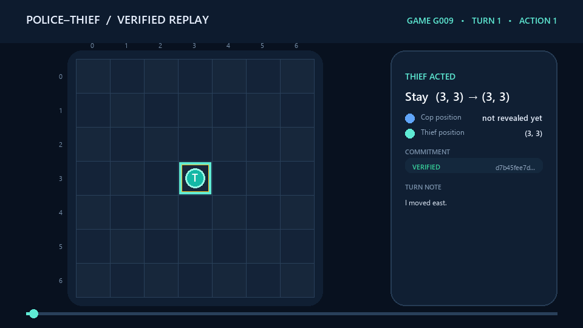
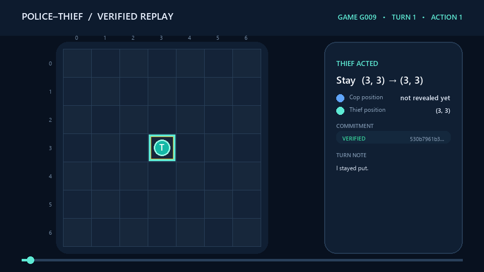

# Police–Thief P2P · Thief Agent

> An evasive autonomous agent that survives through uncertainty-aware movement, future-mobility analysis, validated Gemini decisions, and cryptographically auditable peer-to-peer play.

[](https://www.python.org/)
[](https://docs.astral.sh/uv/)
[](https://gofastmcp.com/)
[](https://docs.astral.sh/ruff/)

This is the **thief-side repository** for the University of Haifa **Orchestration of AI Agents** final project (AY26). Its companion is the [cop repository](https://github.com/aishadahesh/uoh-ay26-final-project-cop).

The thief does not share memory with the cop, does not read the cop’s coordinates, and does not trust a central referee. It maintains its own board, belief map, private nonces, network state, audit evidence, and final report. The two peers agree only through signed configuration and a validated wire protocol.

## Abstract

This repository presents an autonomous evasive agent for a decentralized, partially observable pursuit game. Its objective is not merely to maximize immediate distance: it must preserve future mobility under a changing barrier geometry, reason from uncertain scent evidence, reject illegal model output, and coordinate with an untrusted opponent over a failure-prone public network. The implementation combines belief-aware escape scoring, anti-oscillation state history, bounded Gemini selection, deterministic legality checks, FastMCP peer orchestration, nonce-backed SHA-256 commitments, Step-0 environment attestation, mutual replay audit, and machine-readable reporting.

The research emphasis is verifiable autonomy. The Thief never consumes the Cop's hidden coordinates or private strategy; every candidate action is filtered through the local board engine; and every reported outcome must be reproducible from signed evidence. Six counted six-sub-game series against independent teams ground the evaluation. A survival win and a capture loss are both committed as paired `JSON + GIF` evidence, making strengths and failure modes equally inspectable.

### Contributions

- A role-isolated Thief process that uses only protocol-authorized observations.
- An interpretable escape policy combining threat distance, future exits, route history, dead-end risk, and anti-reversal pressure.
- A validated LLM boundary with strict structured output, corrective retry, local legality checks, and deterministic fallback.
- A fail-closed audit and consensus pipeline compatible with independently implemented peers.
- Reproducible replay packages for one Thief win and one Thief loss, plus empirical results across 18 counted sub-games.

## Why this project is interesting

Survival is not simply “move away.” The thief must answer harder questions:

- Which legal action increases distance without entering a dead end?
- Is an edge cell safer now but strategically worse next turn?
- Can a Gemini response be useful without letting an LLM violate board rules?
- How can two opponents prove a match result without revealing hidden actions early?
- How should a completed result survive network, OAuth, or reporting failures?

This repository combines evasive planning, constrained model output, decentralized orchestration, cryptographic commitments, and evidence-first reporting.

## Contents

- [System at a glance](#system-at-a-glance)
- [Formal problem formulation](#formal-problem-formulation)
- [Required interface evidence](#required-interface-evidence)
- [Thief intelligence](#thief-intelligence)
- [Validated Gemini decision pipeline](#validated-gemini-decision-pipeline)
- [Trust and protocol design](#trust-and-protocol-design)
- [Installation](#installation)
- [Run modes](#run-modes)
- [Animated game replays](#animated-game-replays)
- [Two-computer match guide](#two-computer-match-guide)
- [Verified match history](#verified-match-history)
- [Experimental methodology](#experimental-methodology)
- [Configuration](#configuration)
- [Results and automatic email](#results-and-automatic-email)
- [Testing and quality](#testing-and-quality)
- [Project map](#project-map)
- [Troubleshooting](#troubleshooting)
- [Academic design notes](#academic-design-notes)
- [Limitations and future work](#limitations-and-future-work)
- [Recommended self-score for submission](#recommended-self-score-for-submission)

## System at a glance

```text
┌──────────────────────── THIEF PROCESS ──────────────────────┐
│ local board + cop belief + escape policy + private nonce    │
│                                                             │
│ observe scent → estimate threat → enumerate legal actions   │
│                                    ↓                        │
│                         score distance + future exits        │
│                                    ↓                        │
│                 Gemini choose → validate → repair/retry      │
│                                    ↓                        │
│                 final live validation → sealed turn         │
└─────────────────────────── FastMCP P2P ─────────────────────┘
              ↓ final mutual audit and sign-off
       result JSON → optional Gmail gatekeeper → recipient
```

The code is separated by responsibility:

| Layer | Responsibility |
|---|---|
| `domain/` | Board physics, scent, belief, escape scoring, capture, replay |
| `services/` | Gemini boundary, MCP protocol, commit–reveal, reporting |
| `gui/` | Play modes, network setup, live board, replay viewer |
| `shared/` | Configuration loading, constants, validation, versioning |

## Formal problem formulation

The match is modeled as a finite-horizon Dec-POMDP

```text
M = ⟨I, S, {Aᵢ}, T, R, {Ωᵢ}, O, H⟩
```

with agents `I = {cop, thief}` and horizon `H = 35`. A world state contains both positions, the public barrier set, the active turn, remaining budgets, and terminal status. The Thief action set is the legal subset of north, south, east, west, and `STAY`; `T` is deterministic after legal actions are selected. Rewards are asymmetric: survival favors the Thief, while capture favors the Cop.

The Thief's observation contains its own coordinate, public board changes, signed protocol events, and scent evidence, but excludes the Cop's hidden coordinate. The controller therefore maintains a belief `b_t(s)` over feasible Cop locations and evaluates escape actions relative to that distribution. Strategic uncertainty and physical legality remain separate: a belief can be wrong, but the board engine still prevents an illegal move.

No reinforcement-learning policy was trained, so learning curves are not applicable. The chosen Bayesian/heuristic policy is intentionally interpretable and reproducible. Gemini contributes bounded tactical selection, but cannot alter the action set, board state, capture semantics, or audit evidence.

The physical observation model follows the shared scent equation with `ρ = 0.10`, center intensity `0.9`, and a `5 × 5` footprint:

```text
τᵢⱼ(t+1) = max(0, (1 - ρ)τᵢⱼ(t) + Δτᵢⱼ)
b'(s) ∝ Predict(b)(s) · (τ(s) + ε)
```

The prediction step distributes belief through legal one-step transitions before scent is used as a likelihood. Barriers remove impossible cells, and the posterior is renormalized. This prevents a stale scent peak from becoming permanent certainty and keeps deceptive language separate from non-fakeable physical evidence.

## Required interface evidence

The Live GUI renders only local truth plus the inferred belief heatmap. The Cop's actual hidden coordinate is deliberately absent.


The Replay Viewer recomputes every commitment before displaying its status. The `Verified OK` label below is therefore an audit result, not a decorative caption.


## Thief intelligence

### 1. Partial-observation threat model

The thief never receives the cop’s actual cell. `BeliefMap` maintains probability across open board cells and updates from scent evidence. The most likely cell, `arg_max()`, becomes the current threat estimate.

This distinction matters: the policy reacts to evidence, not hidden global truth.

### 2. Legal actions first

Every turn begins with `Board.legal_moves(current_position)`. That method delegates to the same movement engine used during execution, so prompt construction and actual board physics share one source of truth.

Legal actions can include north, south, east, west, and stay. Off-board directions and cells occupied by barriers are omitted.

### 3. Escape score: distance plus future mobility

The original baseline maximized only Manhattan distance from the believed cop. That is safe locally but can create edge oscillations or move into a cell with too few future exits.

The improved thief evaluates every legal candidate with a lexicographic safety score:

```text
(distance from believed cop, number of future exits, moved instead of stayed)
```

This preserves distance as the primary objective while using future mobility to break ties. The policy therefore prefers:

- greater separation from the threat estimate;
- open cells with multiple escape routes;
- movement over unnecessary waiting;
- recovery routes when barriers restrict the board;
- avoiding corners and dead ends when an equally distant alternative exists.

### 4. Different game states

The same scoring logic adapts naturally:

| Situation | Preferred behavior |
|---|---|
| Cop belief is nearby | Maximize immediate separation |
| Two moves are equally distant | Choose the cell with more future exits |
| A barrier blocks the expected route | Re-enumerate legal actions from the updated board |
| The thief reaches an edge | Avoid corner commitment when a mobile alternative exists |
| Only `STAY` remains | Remain legal and allow boxed-in resolution to proceed |
| Gemini is unavailable | Use the validated deterministic escape choice |

## Validated Gemini decision pipeline

Gemini is the primary tactical selector in agent-driven network play, but it operates inside a strict action boundary.

### Prompt contract

Gemini receives:

- the thief role and turn horizon;
- the thief’s own position;
- the believed cop position, explicitly labeled as an estimate;
- every allowed action and its exact destination cell;
- per-action safety information `(distance, exits, moved)`;
- explicit restrictions against omitted directions, diagonals, coordinates, and barrier actions;
- a strict JSON response schema.

Expected response:

```json
{"action":"EAST","reason":"Keeps distance while preserving three exits."}
```

### Parsing and validation

The parser supports strict JSON and remains backward-compatible with the earlier `MOVE|reason` format. Exact names, move codes, and unambiguous aliases such as `RIGHT → EAST` are normalized—but only if the resulting move exists in the current legal set.

Validation happens twice:

1. **Response validation:** reject missing, malformed, invented, or unavailable actions.
2. **Live-state validation:** immediately before execution, compare the selected move with a fresh `board.legal_moves()` result.

No Gemini-generated action can bypass `Board.apply_move`.

### Repair before fallback

An invalid response no longer activates fallback immediately. The advisor sends one corrective prompt containing:

- the rejection reason;
- a clipped form of the previous response;
- the current exact allowed actions;
- an instruction to copy one legal action name and return JSON only.

Fallback is used only when correction fails or the provider is genuinely unavailable.

### Decision logging

Network output now explains:

- which action Gemini selected;
- whether it passed validation;
- how many attempts were needed;
- why a response was rejected;
- why fallback was activated;
- which fallback move was selected.

This turns “Gemini returned an invalid move” into actionable evidence.

Configure the advisor in `.env`:

```env
GEMINI_API_KEY=your_google_ai_studio_key
GEMINI_MODEL=gemini-3.1-flash-lite
GEMINI_TIMEOUT_SECONDS=8
GEMINI_ENABLE_MODEL_FALLBACKS=false
```

Human-vs-human mode remains fully offline.

## Trust and protocol design

### Fail-closed pre-game rules gate

Before either peer sends `READY` or executes a move, both sides now exchange and validate a redacted conformance manifest. The validator uses the official project definition as its canonical policy, not merely the opponent's copy. It strictly checks the complete `config/game.json` schema, types, allowed fields, protected board and scoring values, legal actions, initial positions, six-game series size, checksums, role pairing, sub-game number, and the shared timeout agreement.

The opponent's active public GitHub repository is pinned to its announced 40-character commit. At that immutable revision the gate verifies `config/game.json`, confirms that `config/game.toml` and the required project documentation exist, and checks protected rule values. Only a redacted public TOML projection crosses the wire: team identity, repository links, sub-game number, and shared timeout. Strategy settings, prompts, Gemini configuration, credentials, email details, ports, and opponent URLs remain private and are never inspected or transmitted.

Every attempt creates `results/network/validation_<game-id>_gNN.json`. A passing report records policy and file checksums plus repository checks. A failure records the exact file and field, error code, expected value, and received value; the process stops before declarations, `READY`, turns, or result generation.

### Independent peers

The thief and cop each run a FastMCP server and client. Neither side controls the other’s process. Match progression uses four protocol operations:

1. `negotiate` — bind peer identity to signed game terms;
2. `receive_turn` — exchange sealed movement and public declarations;
3. `submit_audit` — reveal records and verify commitments;
4. `receive_control` — coordinate readiness and lifecycle state.

### Commit–reveal

Every private turn is committed before final reveal:

```text
commit = SHA256(state || move || intent || nonce)
```

The nonce prevents the opponent from guessing the sealed content and prevents the sender from changing its story later. During final audit, both peers recompute all commitments and reject mismatches.

### Public barriers, private movement

The cop’s barrier placement changes shared board geometry and is declared immediately. The thief applies it locally through the board engine before its next decision. Movement details remain sealed until audit.

### Mutual result agreement

A result is not trusted merely because one peer writes it. The audit must validate records, outcome claims must agree, and both peers independently derive scores and log hashes.

## Installation

Requirements:

- Python 3.11 or newer;
- [`uv`](https://docs.astral.sh/uv/);
- Tk support for graphical modes;
- a Gemini API key for agent modes;
- Gmail OAuth files only for automatic reporting.

```bash
git clone https://github.com/aishadahesh/uoh-ay26-final-project-thief.git
cd uoh-ay26-final-project-thief
uv sync
```

Install Gmail support when automatic email is needed:

```bash
uv sync --extra email
```

Create local environment settings:

```powershell
Copy-Item .env-example .env
```

Never commit `.env`, `credentials.json`, or `token.json`.

## Run modes

### Interactive command center

```bash
uv run python -m police_thief play
```

Choose human-vs-human, human-vs-agent, local agent-vs-agent, or a real two-computer MCP match.

### Standalone thief visualization

```bash
uv run python -m police_thief demo --role thief
```

Displays the local-truth board and evolving belief mechanics without networking.

### Local simulation

```bash
uv run python -m police_thief simulate
```

Exercises movement, scent, beliefs, capture, and scoring in one process.

### Readiness doctor

```bash
uv run python -m police_thief doctor --role thief --offline
```

For network-aware checks:

```bash
uv run python -m police_thief doctor --role thief --check-opponent
```

A machine-readable report can be saved with `--json-output path/to/report.json`.

### Real peer

```bash
uv run python -m police_thief peer --role thief
```

Starts a role-safe six-game coordinator. It launches a fresh Thief process for games 1/3/5 and a fresh process from the sibling Cop repository for games 2/4/6, advances the sub-game number, preserves verified completed games when resuming, and performs final series consensus after game 6. Neither child process changes role or reads the sibling role's private configuration.

### Non-counted smoke peer

```bash
uv run python -m police_thief peer --role thief --smoke-test --non-counted
```

The explicit `--non-counted` requirement prevents deterministic connectivity checks from being mistaken for league evidence.

### Replay an audited log

```bash
uv run python -m police_thief replay --log results/network/log_AHK-YOSI-vs-uoh-ay26-C001_g01.json
```

The viewer recalculates commitments and flags modified evidence.

## Animated game replays

The replay GIFs below were generated from signed logs with the companion Cop repository's `scripts/visualize_game_log.py`. The renderer verifies commitments, reconstructs movement and barriers, and marks claims and terminal events. See [Running the project](docs/RUNNING.md#8-replay-and-read-the-artifacts) for the replay workflow.

### Thief win — G009 sub-game 2

The Thief (`uoh-ay26`) stays legal and survives the full 35-step limit against `sharNamr`.



Reproduce it from [`thief-win-G009-g02.json`](assets/replays/thief-win-G009-g02.json).

### Thief loss — G009 sub-game 6

The opponent Police completes a signed boxed-in capture at step 25. Keeping a losing example makes the strategy limitations auditable.



Reproduce it from [`thief-loss-G009-g06.json`](assets/replays/thief-loss-G009-g06.json).

Both examples are from a mutually verified counted series; no positions or events were invented for the animations. The committed copies are intentionally isolated from the mutable `results/` workspace; provenance and regeneration commands are recorded in [`assets/replays/README.md`](assets/replays/README.md).

## Two-computer match guide

### Prepare both computers

1. Run `uv sync` in each repository.
2. Configure `.env` with Gemini credentials.
3. Confirm both sides have byte-identical `config/game.json` files.
4. Fill team identities, repositories, shared secret, game ID, current sub-game number, output, and email defaults in `config/network_match.json`.
5. Set the opponent URL in `config/thief/game.toml`.
6. Start the project's **Cloudflare Tunnel (cloudflared)** for the local thief MCP port.

### Cloudflare Tunnel

This project uses **Cloudflare Tunnel (`cloudflared`)** to expose the local FastMCP server securely over HTTPS without opening an inbound router port. Start the thief application first, then open another terminal and publish port `8802`:

```bash
cloudflared tunnel --url http://127.0.0.1:8802
```

For a quick tunnel, `cloudflared` prints a temporary `https://<random>.trycloudflare.com` address. The MCP endpoint shared with the cop must append `/mcp`:

```text
https://<random>.trycloudflare.com/mcp
```

Put that full address in the cop peer's **Opponent public URL**. Put the cop's corresponding Cloudflare URL in this thief repository's opponent configuration. Keep the `cloudflared` process running throughout the match; restarting a quick tunnel generates a new URL that must be updated on the other peer.

A named Cloudflare Tunnel and custom hostname may also be used when a stable URL is required. Use the explicit IPv4 origin `http://127.0.0.1:8802`; this avoids a Windows `localhost` IPv6 mismatch when the server is listening only on IPv4.

### Launch

```bash
# Our team starts from this repository when Thief plays sub-games 1/3/5
uv run python -m police_thief peer --role thief

# If our team is Cop in sub-games 1/3/5, run this from the sibling Cop repository
cd ../uoh-ay26-final-project-cop
uv run python -m police_thief peer --role police
```

Each side may start first and wait at negotiation.

The public command coordinates the full series automatically. Each child still handles exactly one fixed-role sub-game; the parent alternates between the independent repositories without sharing their private role configuration or process memory.

For the exact launch order, dual-hostname tunnel example, resume behavior, and pre-match checks, use [Running the project](docs/RUNNING.md). Before playing a new team, exchange every item in the [Opponent match guide](docs/OPPONENT_MATCH_GUIDE.md).

### Shared versus private values

The following must agree:

- shared configuration fingerprint;
- game/series identity;
- scoring and maximum turns;
- shared match secret;
- team and repository declarations.

These remain private:

- Gemini keys;
- OAuth credentials and tokens;
- private nonces;
- local process state.

## Configuration

| File | Visibility | Purpose |
|---|---|---|
| `config/game.json` | Shared | Board, scent, scoring, league, timing, protocol rules |
| `config/thief/game.toml` | Private | Thief port, opponent URL, timeouts, role strategy |
| `config/network_match.json` | Local launcher defaults | Match identity, teams, repositories, output, email switch |
| `config/game.toml` | Submission-facing private config | Required role-specific submission settings |
| `.env` | Secret/local | Gemini and other provider settings |
| `credentials.json` | Secret/local | Google OAuth client configuration |
| `token.json` | Secret/local | Reusable Gmail authorization token |

The tracked network defaults currently control whether automatic email begins enabled. The GUI can override that choice for the current launch.

## Verified match history

The team has completed **six counted six-sub-game series**. “Series W/L” is from `uoh-ay26`'s perspective.

| Series | Opponent | Series W/L | Sub-games won | Score | Mutual agreement |
|---|---|---:|---:|---:|---|
| G001 | `najamjad` | Loss | 0–6 | 30–90 | Confirmed |
| G002 | `amireman` | Win | 4–2 | 60–40 | Confirmed |
| G009 | `sharNamr` | Loss | 2–4 | 40–60 | Confirmed |
| `SMNGRP05-vs-uoh-ay26-C01` | `SMNGRP05` | Tie | 3–3 | 47–47 | Confirmed |
| `AHK-YOSI-vs-uoh-ay26-C001` | `ahk-yosi` | Win | 5–1 | 75–35 | Confirmed |
| `counted-2` | `yanell11` | Loss | 0–6 | 30–90 | Confirmed |
| **Total** | 6 opponents | **2–3–1** | **14–22** | **282–362** | 6 verified series |

The table is derived from the saved aggregate result JSON files. Friendly and explicitly non-counted verification runs are excluded.

## Experimental methodology

Evaluation covers six counted series against six independently developed opponent teams. Each series contains six sub-games with alternating roles. A result is included only after both implementations agree on the six outcomes, role-aware scores, winner, and canonical consensus digest. Friendly, partial, and aborted runs are excluded.

Competitive performance and evidence quality are reported separately. Survival or capture determines score; mutual audit determines whether the observation is admissible. This avoids treating a locally favorable but unverifiable outcome as success. The 36-sub-game sample demonstrates real cross-team interoperability and provides useful failure cases, but it is not large enough to claim statistical dominance over unseen strategies.

Each committed replay is generated from the same signed log consumed by the audit implementation. The renderer verifies commitments and reconstructs movement, barriers, claims, and termination. The GIF communicates behavior; the adjacent JSON preserves the machine-verifiable source.

## Results and automatic email

A verified match or series produces artifacts such as:

```text
results/network/
├── declaration_G009.json
├── config_G009_g01.json
├── log_G009_g01.json
├── result_G009_g01.json
└── result_G009.json
```

The result is constructed from audited records, scores, identities, repository links, and the replay-log hash.

To enable automatic Gmail reporting:

1. Run `uv sync --extra email`.
2. Place `credentials.json` in the project root.
3. Complete OAuth browser consent once to create `token.json`.
4. Enable `email.automatic` in `config/network_match.json` or check the option in the network setup GUI.
5. Verify the recipient before starting.

Email is sent only after mutual match completion. The sender uses the minimal `gmail.send` scope and passes through quota, rate-limit, anomaly, and retry controls. The final JSON is attached directly.

## Testing and quality

```bash
uv run pytest --cov
uv run ruff check .
uv run ruff format --check .
```

`ruff check .` passes clean; `pytest` reports 627 passed / 2 skipped. Two gates are
honestly not met and are tracked rather than hidden: coverage is ~81% against the
configured `fail_under = 85`, and `ruff format --check` still reports files it would
reformat -- formatting was deliberately not applied wholesale before submission to
keep the final diffs reviewable.

Focused strategy coverage includes:

- legal-action enumeration;
- threat-distance improvement;
- equal-distance mobility tie-breaking;
- malformed and unavailable Gemini actions;
- corrective regeneration before fallback;
- alias and JSON parsing;
- validation of the fallback itself;
- real two-peer integration and audit behavior.

Coverage is enforced at **85% minimum** in `pyproject.toml`.

GUI tests require a working Tcl/Tk installation. External Gmail sends and public tunnel sessions remain manual integration boundaries.

## Project map

```text
src/police_thief/
├── domain/
│   ├── board.py              # legal movement and barrier state
│   ├── belief.py             # believed cop distribution
│   ├── scent.py              # evidence emission and decay
│   ├── heuristics.py         # distance and mobility escape scores
│   ├── capture.py            # capture and boxed-in rules
│   └── strategy/             # role-aware deterministic policy
├── services/
│   ├── gemini_agent.py       # prompt, parsing, repair, strict validation
│   ├── network_match.py      # live decision and audit orchestration
│   ├── network_protocol.py   # signed wire schema
│   ├── commit_reveal.py      # turn sealing and verification
│   ├── mcp_server.py         # inbound FastMCP tools
│   ├── mcp_client.py         # opponent calls
│   └── network_reporting.py  # audited Gmail delivery
├── gui/                      # mode selection, board, network setup, replay
├── shared/                   # validated configuration
└── main.py                   # CLI entry point
```

Start with [Running the project](docs/RUNNING.md) and the [Opponent match guide](docs/OPPONENT_MATCH_GUIDE.md). Detailed design decisions live in `docs/PRD_*.md`; the chronological engineering record is `ProgressDoc.md`.

## Troubleshooting

### Gemini repeatedly returns invalid actions

Read the new rejection logs. They show the raw action category, allowed actions, correction count, and fallback choice. Confirm the running code includes the strict JSON prompt and that both peers use the expected board state.

### Gemini is unavailable

Check `GEMINI_API_KEY`, model name, timeout, and network access. The deterministic strategy remains safe and legal when the provider fails.

### Opponent is unreachable

Verify `cloudflared`, the `http://127.0.0.1:8802` origin, the public HTTPS URL, and the required `/mcp` suffix. HTTP 502 normally means the route exists but the origin is unavailable; 530/1033 means no connected tunnel route. Remember that a quick-tunnel URL changes after restart. Use `doctor --check-opponent` before a counted match.

### Negotiation fails

Compare `config/game.json` byte-for-byte and verify the secret, team names, game ID, repository URLs, and opponent identity expectations.

### Tkinter cannot find `init.tcl`

Install or repair a Python distribution containing Tcl/Tk. CLI simulations and non-GUI tests remain available.

### Gmail is not sent

First check whether automatic email was enabled. Then verify the email extra, OAuth files, recipient, token validity, and emitted reporting logs.

### Result JSON exists after a reporting failure

That is expected: gameplay evidence is created before email delivery. Preserve the result and diagnose the reporting boundary separately.

## Academic design notes

### FastMCP orchestration dilemmas

Both agents act as MCP server and client, so there is no central process that can silently resolve timing disputes. Negotiation must survive unequal startup order, role swaps, quick-tunnel replacement, transient 502 responses, and late audit traffic. Explicit lifecycle states, bounded queues, retry windows, role-checked envelopes, fresh per-sub-game processes, and a series coordinator isolate these concerns without sharing private state across repositories.

Information timing creates a second dilemma. Early revelation can leak a tactical advantage, while complete secrecy would prevent synchronization of public barriers and capture claims. The protocol publishes only rule-mandated shared events during play, commits private state with a nonce-backed SHA-256 digest, and defers full revelation to the audit phase. The Thief responds truthfully to a matching Capture Claim and terminates without making an escape move.

### Orchestrator and Gatekeeper responsibilities

The Orchestrator controls phase order—preflight, negotiation, Step-0, turns, audit, consensus, artifacts, and reporting—but delegates action selection to the decision module and physical legality to the board. This prevents networking code or Gemini output from becoming an alternative rules engine.

The Gatekeeper enforces external boundaries: canonical shared configuration, peer identity and repository revision, time and token budgets, message schemas, reporting quotas, and Gmail recipient policy. Invalid model responses are rejected locally; invalid protocol messages fail closed; a failed email cannot alter completed evidence. The separation makes strategy, transport, audit, and reporting failures independently diagnosable.

### Evidence and reproducibility

Step-0 binds participant identity, code revision, hardware, and model metadata. Turn commitments bind state, move, intent, and nonce. Final audit recomputes those commitments, compares result claims, and exchanges a canonical series digest. The two examples in `assets/replays/` preserve signed logs beside their rendered views so a reviewer can reproduce both success and failure without relying on mutable match folders.

### Specification interpretations

The official mandatory-parameters table takes precedence when illustrative configuration examples differ. Coordinate coincidence is treated only as a capture opportunity: a legal capture requires the Police's post-move landing, a Capture Claim for that cell, and the Thief's truthful `caught=true` response. The Thief then terminates without an escape move. Step-0 is preserved as a sealed `step: 0`, `type: "system_spec"` audit record, while final series consensus uses a dedicated empty-record envelope so a post-series exchange cannot mutate an already completed game.

## Limitations and future work

- Belief accuracy is bounded by the public scent signal and can degrade under saturation.
- A finite-history heuristic reduces oscillation but does not solve the full adversarial game tree.
- Gemini availability and public tunnels remain external operational dependencies; deterministic fallback preserves legality, not necessarily optimality.
- Six opponents provide meaningful interoperability evidence but limited statistical coverage.
- Two of the six retained bundles report a `derivation_mismatch` on `game_uid` under this repository's own `validate_submission_directory`, for two different reasons. `SMNGRP05-vs-uoh-ay26-C01` records the uid in the league interop-kit's *labeled* form, which folds the agreed `game_id` into the derivation; this repository's `derive_game_uid` predates that variant and derives the unlabeled form from the agreed terms and group IDs alone. `counted-2` records a uid that neither form reproduces from the terms committed alongside it, so the declaration's uid and the locally derivable one disagree. In both cases the bundle is internally consistent — all fourteen required attachments carry the same uid — and both peers confirmed the series consensus digest at match time; the mismatch is between the recorded uid and this repository's local re-derivation, not between the two teams. The other four bundles validate cleanly here.
- Future work could compare mobility scoring with bounded-depth minimax, risk-sensitive planning over belief states, or reinforcement learning, provided every learned action remains inside the existing validation and audit boundary.

## Recommended self-score for submission

**Recommendation: 84 / 100 for the group.**

Per rule 55 (`docs/tasks.md` §11, line 839), this figure scores **code quality only and
deliberately ignores the league game outcome** — the 2–2–1 series record above played no part in
it. The weighting follows the four mandatory grading axes of Table 4 (§11.3.2), 25 points each.
Every deduction below names the open `docs/TODO.md` item that documents it, so the number can be
audited rather than taken on trust.

| Axis (Ch.) | Score | What earns it | What it loses |
|---|---:|---|---|
| **Coordination** (Ch.2) | 21 / 25 | Peer-to-peer FastMCP with no central referee; the four-tool contract; six counted six-sub-game series completed cross-machine over public tunnels with alternating roles and reciprocal consensus | The mid-match disconnect integration test does not pass in the cop repo (`T0522`, `T0622`); the slow-but-responsive opponent path is unit-tested only, never over real HTTP (`T0530`) |
| **Adaptation** (Ch.4, 6) | 20 / 25 | Pheromone emission/decay, a belief map that demonstrably drives move selection, a deterministic brain, and a standalone bluff classifier | Verbal hints are never fused into the belief map with a trust weight (`T0283`, `T0290`); no LLM sits on the per-step path — hints are template-generated at zero token cost (`T0328`); the per-series token budget is not enforced (`T0316`) |
| **Integrity** (Ch.5) | 23 / 25 | SHA-256 commit–reveal with end-game nonce reveal, mutual per-sub-game audit, signed Step-0 declarations, a reciprocal series consensus digest, and a submission validator that four of the six retained bundles pass cleanly | Two bundles fail the local validator on `game_uid` — `SMNGRP05-vs-uoh-ay26-C01` on the interop-kit's labeled form and `counted-2` on a uid this repository cannot re-derive from the committed terms (`T0898`); both-sides Gmail delivery is proven for G009 but not for every counted series (`T0866`, `T0737`) |
| **Architecture** (Ch.8, 10) | 20 / 25 | Gatekeeper and Orchestrator patterns, a real rate limiter, typed peer-client errors, and graceful degradation rather than crashes; 626 (cop) and 627 (thief) tests passing | Rule 3 is not satisfied — no single Orchestrator entry point fronts all sub-systems (`T0837`, found by our own review); line coverage is ~81% in both repos against the project's own 85% gate; rule 47's illegal-exit case is still unresolved, with `MoveRejectedError` propagating uncaught (`T0881`) |

### Why not higher, and why not lower

The case against a higher score is that three of the deductions are real engineering gaps rather
than paperwork: the missing single-Orchestrator entry point is a structural deviation from the
rulebook's own architecture rule that we found and chose to record instead of quietly restating the
requirement; the belief map never consumes verbal hints, so one full half of the Adaptation story
(scent *and* language) is only half-built; and a disconnect test that should prove the
technical-loss path currently fails.

The case against a lower score is that the mandatory end-to-end spine genuinely works and is
evidenced, not asserted. Six counted series against six distinct opponents were completed
cross-machine — against a `min_games_to_pass` of 2 — and each is retained as a signed, replayable
bundle whose scores were recomputed from the JSON for the table above rather than transcribed.
Where a requirement was not met, the repository says so in the open TODO item rather than
presenting it as done.

### Verification snapshot

These figures were measured, not estimated:

| Check | Cop repo | Thief repo |
|---|---|---|
| Test suite | 626 passed, 3 skipped, **1 failing** (`test_a_mid_match_disconnect_resolves_to_technical_loss_on_both_sides`) | 627 passed, 2 skipped, 0 failing |
| Line coverage | ~81% (gate: 85%) | 80.98% (gate: 85%) |
| Files within the 150-code-line guideline | all except `services/network_match.py` (~1976 code lines; documented exception, `T0899`) | all except `services/network_match.py` (~1970 code lines; documented exception, `T0899`) |
| Retained bundles passing `validate_submission_directory` | G001, G002, G009 pass; `SMNGRP05-vs-uoh-ay26-C01` fails on `game_uid` | `AHK-YOSI-vs-uoh-ay26-C001` passes; `counted-2` fails on `game_uid` |

Two further rulebook items are excluded from the score above because they are submission-time or
course-logistics actions rather than code quality: the annotated Git tag (`T0875`, rule 41) and the
Word/PDF per-member deliverables (`T0877`, `T0878`, rules 43–44).

## Team and companion repository

Built by **Aisha Abu Dahesh** and **Yousef Asadi** for the University of Haifa Orchestration of AI Agents course.

Companion cop implementation: [uoh-ay26-final-project-cop](https://github.com/aishadahesh/uoh-ay26-final-project-cop).

### Credits and license

See [`LICENSE`](LICENSE) for educational-use terms. Course specifications and submission guidance remain the intellectual work of their respective authors.
